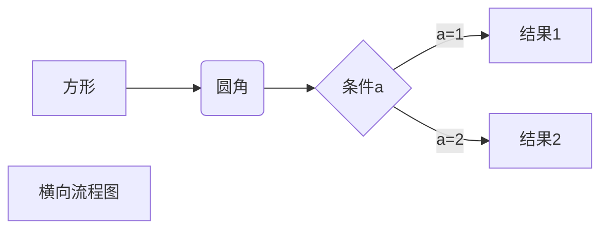
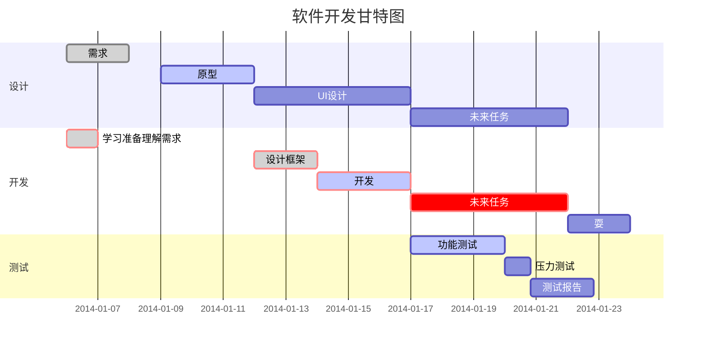
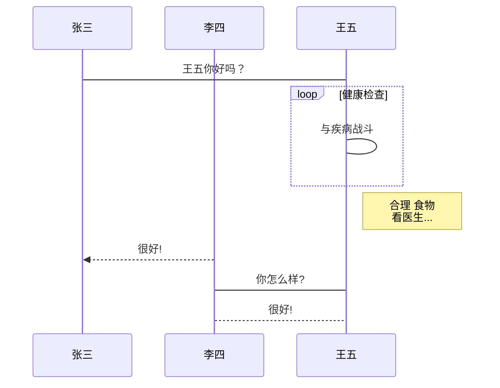
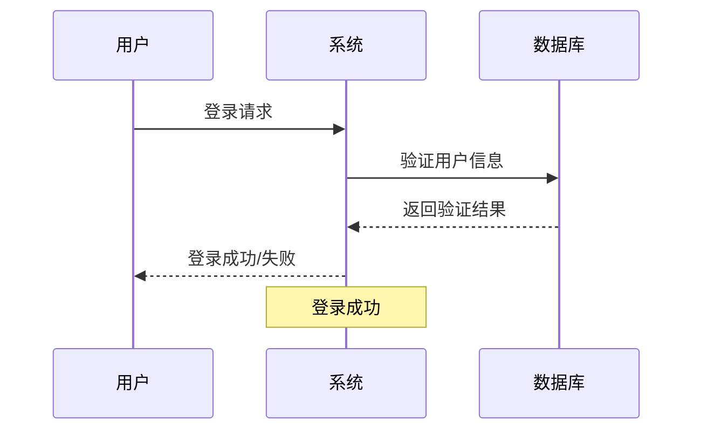

# Great Project by ZZY ——Choose 塔防游戏

## 试试加粗体

***再试试加粗的斜体***
**加粗体**  
*斜体*
~~删除字迹吗有点意思~~
<u>来个下划线</u>

### 脚注

宝中最逆天的校长[^校长]

[^校长]:张广银

创建脚注格式类似这样 [^RUNOOB]。

[^RUNOOB]: 菜鸟教程 -- 学的不仅是技术，更是梦想！！！

## 试一试列表

+ 列表1：真正有多少人在自习呢

+ 列表2:我猜也没多少人

### 无序嵌套列表

- 水果
  - 苹果
    - 红苹果
    - 绿苹果
  - 香蕉
  - 橙子
- 蔬菜
  - 胡萝卜
  - 白菜

### 再试试有序嵌套列表

1. 准备阶段
   1. 收集资料
   2. 制定计划
2. 执行阶段
   1. 开始实施
   2. 监控进度
3. 总结阶段

### 最后再试试混合列表

1. 主要任务
   - 子任务A
   - 子任务B
     1. 详细步骤1
     2. 详细步骤2
   - 子任务C
2. 次要任务

### 列表未完成的任务

- [ ] 未完成的任务
- [x] 已完成的任务
- [ ] 另一个未完成的任务

### 多种混合

## 项目待办清单

### 设计阶段
- [x] 需求分析
- [x] 原型设计
- [ ] UI 设计

### 开发阶段
- [ ] 前端开发
  - [x] 页面布局
  - [ ] 交互功能
  - [ ] 响应式适配
- [ ] 后端开发
  - [ ] 数据库设计
  - [ ] API 开发
  - [ ] 性能优化

### 测试阶段
- [ ] 单元测试
- [ ] 集成测试
- [ ] 用户验收测试


## 试一试块，感觉挺好用

> 试一试块好吧  
> 能嵌套吗QAQ  
>如何呢，又能怎

> 区块引用
> 菜鸟教程
> 学的不仅是技术更是梦想

> 这是一个长引用，
包含多行内容，
只需要在第一行使用 > 符号。

> 最外层
> > 第一层嵌套
> > > 第二层嵌套

> **用户反馈**：这个功能很有用！
> 
> > **开发团队回复**：感谢您的反馈，我们会继续优化。
> > 
> > > **项目经理补充**：预计下个版本会有更多改进。

> 区块中使用列表
> 1. 第一项
> 2. 第二项
> + 第一项
> + 第二项
> + 第三项

* 第一项
    > 菜鸟教程 ~~如果要在列表项目内放进区块，那么就需要在 > 前添加四个空格的缩进。~~
    > 学的不仅是技术更是梦想
* 第二项

> 要运行这个脚本，请使用以下命令：
>
> ```bash
> npm install
> npm start
> ```
> 
> 执行后会在 [跳转网站嘻嘻嘻](http://localhost:3000) 看到结果。

> &#x1f4da; **推荐阅读**
> 
> 详细信息请参考 [官方文档](https://example.com)
> 
> [示例图片](/Users/ziyuzhou/Pictures/陶喆蓝砖1.jpg)

- **重点推荐**：📚《人类简史》  
- *正在阅读*：📖《百年孤独》  
- &#x1f4da; 
  
> "在软件开发中，最昂贵的错误就是构建正确的系统错误的方式，或者构建错误的系统正确的方式。"
> 
> — Barry Boehm，软件工程专家

> &#x274c; **错误**
> 
> 连接数据库失败，请检查网络连接或联系系统管理员。

> &#x2139;&#xfe0f; **提示**
> 
> 首次使用需要进行账户验证，验证邮件已发送到您的邮箱。


正常文本段落

    这是缩进式代码块
    每行前面有四个空格
    保持代码的原始格式
    
继续正常文本

## 试一试代码的使用

小的代码`int main()`  `return 0`
感觉很吊的样子

### C++

``` C++
#include <iostream>
using namespace std;
int main(){
    class A{
        private:
        int x,y;
        public:
        int z;
        A(int a,int b) x(a),y(b) {}
        void print(){
            cout << x << " " << y << " " << z << endl;>>
        }
    };
    A a(1,2);
    a.z = 3;
    a.print();
    cout << "Hello World!" << endl;
    return 0;
}
```

### JavaScript

```javascript
const users = [
    { name: "Alice", age: 25 },
    { name: "Bob", age: 30 }
];

const adults = users.filter(user => user.age >= 18);
console.log(adults);
```

### Python

```python
def calculate_area(radius):
    """计算圆的面积"""
    import math
    return math.pi * radius ** 2

# 使用函数
area = calculate_area(5)
print(f"圆的面积是: {area:.2f}")
```

### SQL

```sql
SELECT u.name, u.email, COUNT(o.id) as order_count
FROM users u
LEFT JOIN orders o ON u.id = o.user_id
WHERE u.created_at >= '2024-01-01'
GROUP BY u.id, u.name, u.email
ORDER BY order_count DESC
LIMIT 10;
```

### 有行号的代码块

```javascript {.line-numbers}
function fibonacci(n) {
    if (n <= 1) return n;
    return fibonacci(n - 1) + fibonacci(n - 2);
}

console.log(fibonacci(10));
```

以及

```javascript showLineNumbers
const numbers = [1, 2, 3, 4, 5];
const doubled = numbers.map(x => x * 2);
const sum = doubled.reduce((a, b) => a + b, 0);
console.log(`总和: ${sum}`);
```


## 来个分割线玩玩

***

## ZZY的超链接测试

[ZZY的NJUGit仓库超链接地址](https://git.nju.edu.cn/DavidChou/college_for_zzy)

这是一个链接 [菜鸟教程](https://www.runoob.com)
欢迎访问 [GitHub](https://github.com) 官网
这是 [百度搜索](https://www.baidu.com "百度一下，你就知道")

这个链接用 1 作为网址变量 [Google][1]
这个链接用 runoob 作为网址变量 [Runoob][runoob]
然后在文档的结尾为变量赋值（网址）

  [1]: http://www.google.com/
  [runoob]: http://www.runoob.com/

markdown 我喜欢使用 [GitHub][] 来管理代码。

[GitHub]: https://github.com

markdown# 学习资源推荐

## 在线教程
- [MDN Web Docs][mdn] - 权威的 Web 技术文档
- [RUNOOB][rnb] - 适合初学者的教程网站
- [freeCodeCamp][fcc] - 免费的编程学习平台

## 代码托管
- [GitHub][github] - 最受欢迎的代码托管服务
- [GitLab][gitlab] - 企业级的代码管理平台

<!-- 链接定义区域 -->
[mdn]: https://developer.mozilla.org/
[rnb]: https://www.runoob.com/
[fcc]: https://www.freecodecamp.org/
[github]: https://github.com/
[gitlab]: https://gitlab.com/

markdown直接输入网址：https://www.example.com
用尖括号包围：<https://www.example.com>

markdown联系邮箱：example@email.com
或者：<example@email.com>

## 目录
- [第一章：介绍](#第一章介绍)
- [第二章：安装](#第二章安装)
- [第三章：使用方法](#第三章使用方法)

# 第一章：介绍
这里是介绍内容...

# 第二章：安装
这里是安装说明...

# 第三章：使用方法
这里是使用说明...

<a id="custom-anchor"></a>
## 自定义锚点位置

[跳转到自定义位置](#custom-anchor)


[回到顶部](#)


这个链接用 1 作为网址变量 [RUNOOB][1].
然后在文档的结尾为变量赋值（网址）

[1]: https://static.jyshare.com/images/runoob-logo.png


<!-- 项目徽章 -->
[](https://travis-ci.org/user/repo)
[](https://opensource.org/licenses/MIT)

<!-- 应用商店下载 -->
[](https://apps.apple.com/app/your-app)
[](https://play.google.com/store/apps/details?id=com.yourapp)

$$
\begin{Bmatrix}
   a & b \\
   c & d
\end{Bmatrix}
$$
$$
\begin{CD}
   A @>a>> B \\
@VbVV @AAcA \\
   C @= D
\end{CD}
$$





$$
    \begin{align}
    f(x) &= ax^2 + bx + c \\
    f'(x)  &= 2ax + b \\
    f''(x)  &= 2a
    \end{align}
    $$




嘿嘿嘿，还挺好玩

## 再来个表格测试测试

| 宝中 | 扬中 | 邗中 | 邮中 |
| - | - | - | - |
| 2 | 1 | 3 | 4 |
| 差劲 | 牛逼 | 废物 | 更菜 |

### 注：一定要使用英文的竖线

区分“｜”和"|"

## 试着跳转一下

[点击此处跳转到前面的“试一试列表”](#试一试列表)
